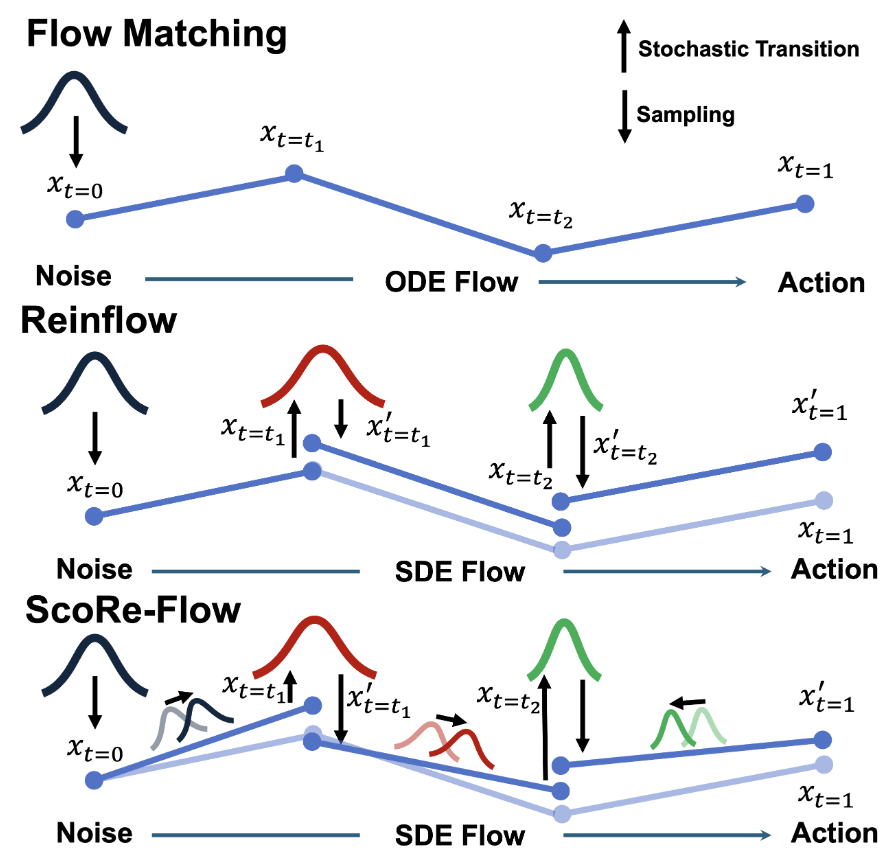
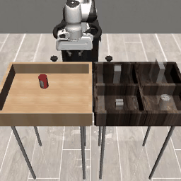
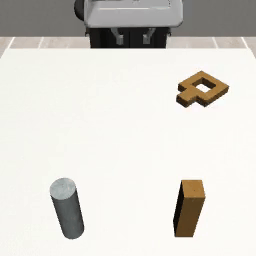
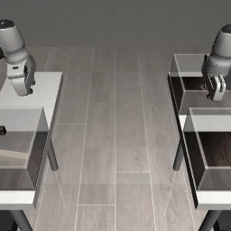

# ScoRe-Flow

> **ScoRe-Flow: Complete Distributional Control via Score-Based Reinforcement Learning for Flow Matching**

<p align="center">
  
</p>

---

## Table of Contents

- [Overview](#overview)
- [Method](#method)
- [Demo](#demo)
- [Key Features](#key-features)
- [Installation](#installation)
- [Quick Start](#quick-start)
- [Project Structure](#project-structure)
- [Experiments](#experiments)
- [Configuration](#configuration)
- [Acknowledgement](#acknowledgement)
- [Citation](#citation)
- [License](#license)

---

## Overview

**ScoRe-Flow** is a novel framework that achieves **complete distributional control** for flow matching policies through score-based reinforcement learning. Unlike prior methods that only control the drift term, ScoRe-Flow introduces a principled Score-SDE formulation that jointly optimizes both the **drift** and **diffusion** of the sampling process via learned score functions.

### The Problem

Flow matching policies generate actions through an iterative denoising process. Standard RL fine-tuning (e.g., DPPO, ReinFlow) only modifies the drift (velocity field), leaving the exploration noise as a fixed hyperparameter. This limits distributional expressiveness and sample efficiency.

### Our Solution: Score-SDE Formulation

ScoRe-Flow reformulates the flow matching sampling process as a **Score-SDE**:

$$dx_t = \underbrace{[v_\theta(x_t, t) + \alpha_\psi(t) \cdot s(x_t, t)]}_{\text{drift: velocity + score guidance}} dt + \underbrace{\sqrt{2 \cdot \alpha_\psi(t)}}_{\text{diffusion}} \, dW_t$$

where:
- $v_\theta(x_t, t)$ is the pre-trained velocity field (flow matching)
- $s(x_t, t) = \frac{t \cdot v_\theta - x_t}{1 - t}$ is the analytically derived score function
- $\alpha_\psi(t)$ is a **learnable time-dependent schedule** (AlphaNet) that controls the strength of score guidance
- The same $\alpha_\psi(t)$ governs both drift correction and diffusion magnitude, ensuring theoretical consistency

### Core Contributions

1. **Score-Based RL Framework**: A principled approach that integrates analytically derived score functions with PPO for flow matching policy optimization
2. **Learnable Distributional Control**: A lightweight neural network ($\alpha_\psi(t)$) that learns to modulate score guidance strength across different denoising timesteps
3. **Decoupled Architecture**: Separate learnable networks for drift control and diffusion control, enabling more flexible optimization than coupled approaches
4. **Complete Distributional Control**: Unlike drift-only methods, ScoRe-Flow controls the full transition distribution (both mean and variance) at every denoising step

---

## Method

### Architecture

ScoRe-Flow builds on flow matching pre-trained policies and adds three learnable components during RL fine-tuning:

| Component | Role | Architecture |
|-----------|------|-------------|
| **Velocity Field** $v_\theta$ | Base policy (pre-trained, frozen) | FlowMLP / ShortCutMLP / ViT |
| **Actor** $v_\phi$ | Fine-tuned velocity field | Copy of $v_\theta$, trainable |
| **AlphaNet** $\alpha_\psi(t)$ | Score guidance schedule | Lightweight MLP: $t \to \text{SiLU} \to \text{SiLU} \to \text{Softplus}$ |
| **Noise Network** $n_\omega(t)$ | Exploration noise | Time-conditioned MLP |

### Key Design Choices

- **Physical Constraint**: $\alpha_\psi(t)$ includes a hard time mask $(1-t)$ to ensure $\alpha \to 0$ as $t \to 1$, preventing score explosion at the boundary
- **Decoupled Training**: The score guidance ($\alpha_\psi$) and exploration noise ($n_\omega$) are trained independently, allowing each to specialize
- **Warm Initialization**: AlphaNet is initialized to output values close to the baseline hyperparameter $\epsilon_t$, ensuring stable training from the start

---

## Demo

### Robomimic Tasks (Image-based Control)

ScoRe-Flow achieves state-of-the-art performance on challenging image-based robotic manipulation tasks:

<table>
  <tr>
    <td align="center"><b>Can</b></td>
    <td align="center"><b>Square</b></td>
    <td align="center"><b>Transport</b></td>
  </tr>
  <tr>
    <td align="center"></td>
    <td align="center"></td>
    <td align="center"></td>
  </tr>
  <tr>
    <td align="center">Pick-and-place a can<br>into a target bin</td>
    <td align="center">Insert a square nut<br>onto a peg</td>
    <td align="center">Two-arm coordination<br>to transport an object</td>
  </tr>
</table>

---

## Key Features

| Feature | Description |
|---------|-------------|
| **Flow Matching** | Support for 1-Rectified Flow and Shortcut Models |
| **Score-Based RL** | Analytically derived score functions for principled policy control |
| **Learnable Schedule** | AlphaNet adaptively modulates score strength per timestep |
| **Decoupled Control** | Independent learnable networks for drift and diffusion |
| **Multi-Environment** | Tested on D4RL Gym, Franka Kitchen, and Robomimic benchmarks |
| **Flexible Architecture** | MLP and ViT-based policy networks |
| **Visual Observations** | Full support for image-based control tasks with dual cameras |

---

## Installation

### Prerequisites

- Python >= 3.8
- PyTorch >= 2.4.0
- CUDA (recommended for GPU acceleration)

### Setup

```bash
# Clone the repository
cd ScoRe-Flow

# Install as editable package (REQUIRED - enables running scripts from any directory)
pip install -e .

# For specific environments, add optional dependencies:
pip install -e ".[gym]"        # OpenAI Gym (Hopper, Walker2d, Ant, Humanoid)
pip install -e ".[kitchen]"    # Franka Kitchen
pip install -e ".[robomimic]"  # Robomimic (Square, Can, Transport)
```

> **Note**: The `pip install -e .` step is essential. It registers `util`, `agent`, `model` etc. as importable modules.

For detailed installation instructions, see [installation/reinflow-setup.md](./installation/reinflow-setup.md).

### Environment Variables Setup

After installation, run the path initialization script once:

```bash
source scripts/utils/set_path.sh
```

The script will interactively set the following variables and append them to `~/.bashrc`:

| Variable | Description |
|---|---|
| `REINFLOW_DIR` | Project root directory (strictly validated at startup; must match code location) |
| `REINFLOW_DATA_DIR` | Offline dataset root directory |
| `REINFLOW_LOG_DIR` | Checkpoint / wandb output directory; all yaml `logdir:` and `base_policy_path:` are resolved from this |
| `REINFLOW_WANDB_ENTITY` | WandB username (optional; can skip if using `wandb=null`) |

> For detailed instructions, see [docs/ReproduceExps.md](docs/ReproduceExps.md#02-environment-variables).

---

## Quick Start

### Training Example (Robomimic)

```bash
# Image-based task with Score-SDE (AlphaNet)
export CUDA_VISIBLE_DEVICES=0,1
export EGL_DEVICE_ID=1
export MUJOCO_EGL_DEVICE_ID=1

python run.py \
    --config-dir=cfg/robomimic/finetune/square \
    --config-name=ft_ppo_shortcut_mlp_img_with_score_alphanet \
    device=cuda:0 \
    sim_device=cuda:1 \
    gamma_score=1.0 \
    seed=42
```

### Training Example (Gym / Kitchen)

```bash
# State-based task with Score-SDE
MUJOCO_GL="egl" xvfb-run -a -s "-screen 0 1024x768x24" python run.py \
    --config-dir=cfg/gym/finetune/kitchen-complete-v0 \
    --config-name=ft_ppo_shortcut_mlp_with_score_alphanet \
    device=cuda:0 \
    gamma_score=1.0 \
    seed=42
```

### Evaluation

```bash
# All .sh scripts must be run from the project root (they use relative paths cfg/... and run.py internally)
bash scripts/eval/robomimic/eval_robomimic_finetune.sh
```

---

## Project Structure

```
ScoRe-Flow/
├── run.py                      # Hydra entry point; auto-downloads data/checkpoints
├── scripts/
│   ├── train/{robomimic,gym,kitchen}/   # Training scripts
│   ├── eval/{robomimic,gym,kitchen}/    # Evaluation scripts
│   └── utils/                           # Environment setup, data preprocessing
├── cfg/                        # Hydra configurations (yaml)
│   ├── robomimic/{pretrain,finetune,eval}/
│   └── gym/{pretrain,finetune,eval}/
├── agent/                      # RL agents (PPO / GRPO)
│   ├── pretrain/
│   ├── finetune/reinflow/      # Core fine-tuning agents
│   └── eval/visualize/
├── model/                      # Network architectures
│   └── flow/ft_ppo/            # PPO/GRPO + Score-SDE + AlphaNet variants
├── env/                        # Environment wrappers
├── data_process/               # Dataset preprocessing
├── visualize/                  # Plotting code
├── util/                       # Utilities
├── external_libs/{mjrl,d4rl}/  # Third-party source code
├── data/                       # Offline datasets (gitignored)
├── logs/                       # Checkpoints / wandb outputs (gitignored)
├── docs/                       # Documentation
└── pyproject.toml
```

### Script Naming Convention

Suffixes in config and script names identify different methods:

| Suffix | Method | Description |
|---|---|---|
| `_score` | Score-based SDE | Fixed $\alpha$ score drift correction |
| `_with_score` | Score-based Drift ReinFlow | Score-corrected drift only, no learnable diffusion |
| `_with_score_alphanet` | **ScoReFlow** | Learnable AlphaNet $\alpha_\psi(t)$ jointly controls drift + diffusion |

> Python model files/class names still use `gammanet`; configs and scripts are unified to `alphanet`.

### Running Scripts

All `.sh` scripts under `scripts/` must be run from the project root:

```bash
bash scripts/train/robomimic/train_robomimic_finetune-grpo.sh
bash scripts/train/gym/train_gym_finetune-with-score.sh
bash scripts/eval/kitchen/eval_kitchen_finetune.sh
```

---

## Experiments

### Supported Environments

| Environment | Type | Observation | Policy Architecture |
|------------|------|-------------|-------------------|
| D4RL Gym (Hopper, Walker2d, Ant, Humanoid) | Locomotion | State | FlowMLP |
| Franka Kitchen (Complete, Partial, Mixed) | Manipulation | State | ShortCutFlowMLP |
| Robomimic (Square, Can, Transport) | Manipulation | Image | ShortCutFlowViT |

### Compared Methods

| Method | Description |
|--------|-------------|
| **Diffusion (DPPO)** | Diffusion policy + PPO fine-tuning |
| **Flow (ReinFlow)** | Flow matching + PPO (drift-only control) |
| **ShortCut (ReinFlow-S)** | Shortcut flow + PPO (drift-only control) |
| **Score-SDE (fixed)** | Fixed hyperparameter $\epsilon_t$ for score guidance |
| **ScoRe-Flow (ours)** | Learnable decoupled AlphaNet for score guidance |

### Ablation Studies

We provide comprehensive ablation experiments in `visualize/Final_experiments/data/ablation/`:

- **Alpha schedule ablation** (`alpha/`): Comparing $\alpha=0$ (no score), $\alpha=1$ (constant), and $\alpha_\psi(t)$ learned (ours)
- **Lambda coupling ablation** (`lamda(mlp)/`): Comparing hyperparameter-coupled, learned-coupled (EpsNet), and learned-decoupled (AlphaNet, ours)
- **Alpha analysis** (`alpha/alpha_visual/`): Visualization of how the learned $\alpha_\psi(t)$ converges during training

### Reproducing Results

```bash
# Pre-training (flow matching)
bash script/train/robomimic/pretrain.sh

# Fine-tuning with ScoRe-Flow
bash train_robomimic_finetune-with-score.sh        # AlphaNet (ours)
bash train_gym_finetune-with-score.sh               # Gym tasks

# Ablation experiments
TASK=humanoid ALPHA=0.0 bash train_gym_finetune-score-alphanet-const.sh
TASK=humanoid ALPHA=1.0 bash train_gym_finetune-score-alphanet-const.sh
```

For complete experiment reproduction, see [docs/ReproduceExps.md](docs/ReproduceExps.md).

---

## Configuration

We use [Hydra](https://hydra.cc/) for configuration management.

### Key Parameters

| Parameter | Description | Default |
|-----------|-------------|---------|
| `gamma_score` | Maximum score guidance coefficient | 1.0 |
| `score_clip_value` | Score function clipping threshold | 10.0 |
| `score_scheduler_type` | AlphaNet type: `mlp`, `linear`, `fixed` | `mlp` |
| `train.n_train_itr` | Training iterations | 301 |
| `train.n_steps` | Rollout steps per iteration | 400 |
| `train.batch_size` | Batch size | 500 |
| `train.actor_lr` | Actor learning rate | 1e-5 |
| `train.critic_lr` | Critic learning rate | 1e-3 |
| `env.n_envs` | Parallel environments | 50 |

### Example Configuration Override

```bash
python run.py \
    --config-dir=cfg/robomimic/finetune/transport \
    --config-name=ft_ppo_shortcut_mlp_img_with_score_alphanet \
    gamma_score=1.0 \
    score_scheduler_type=mlp \
    train.n_train_itr=201 \
    device=cuda:0
```

---

## Documentation

- [Installation Guide](installation/reinflow-setup.md)
- [Experiment Reproduction](docs/ReproduceExps.md)
- [Implementation Details](docs/Implement.md)
- [Known Issues](docs/KnownIssues.md)

---

## Acknowledgement

This project builds upon [ReinFlow](https://github.com/ReinFlow/ReinFlow), which is licensed under the MIT License. We thank the original authors for their excellent open-source work.

Key extensions in this repository:
- **Score-SDE formulation**: Integrates analytically derived score functions into the RL fine-tuning objective, enabling joint control of both drift and diffusion
- **AlphaNet**: A lightweight learnable time-dependent schedule $\alpha_\psi(t)$ that modulates score guidance strength across denoising steps
- **GRPO support**: Critic-free fine-tuning via group-relative policy optimization with explicit KL penalty

---

## Citation

If you find this work useful, please consider citing:

```bibtex
@misc{scoref low2026,
  title   = {ScoRe-Flow: Complete Distributional Control via Score-Based Reinforcement Learning for Flow Matching},
  author  = {},
  year    = {2026},
  url     = {https://github.com/lukAI-c/ScoReFlow}
}
```

If you use the ReinFlow codebase this work builds upon, please also cite:

```bibtex
@misc{zhang2025reinflow,
  title   = {ReinFlow: Fine-tuning Flow Matching Policy with Online Reinforcement Learning},
  author  = {Zhang, Tongzhou and others},
  year    = {2025},
  url     = {https://github.com/ReinFlow/ReinFlow}
}
```

---

## License

This project is licensed under the MIT License — see [LICENSE](LICENSE) for details.
The original ReinFlow code is also MIT licensed; copyright notices for both are retained in `LICENSE`.
