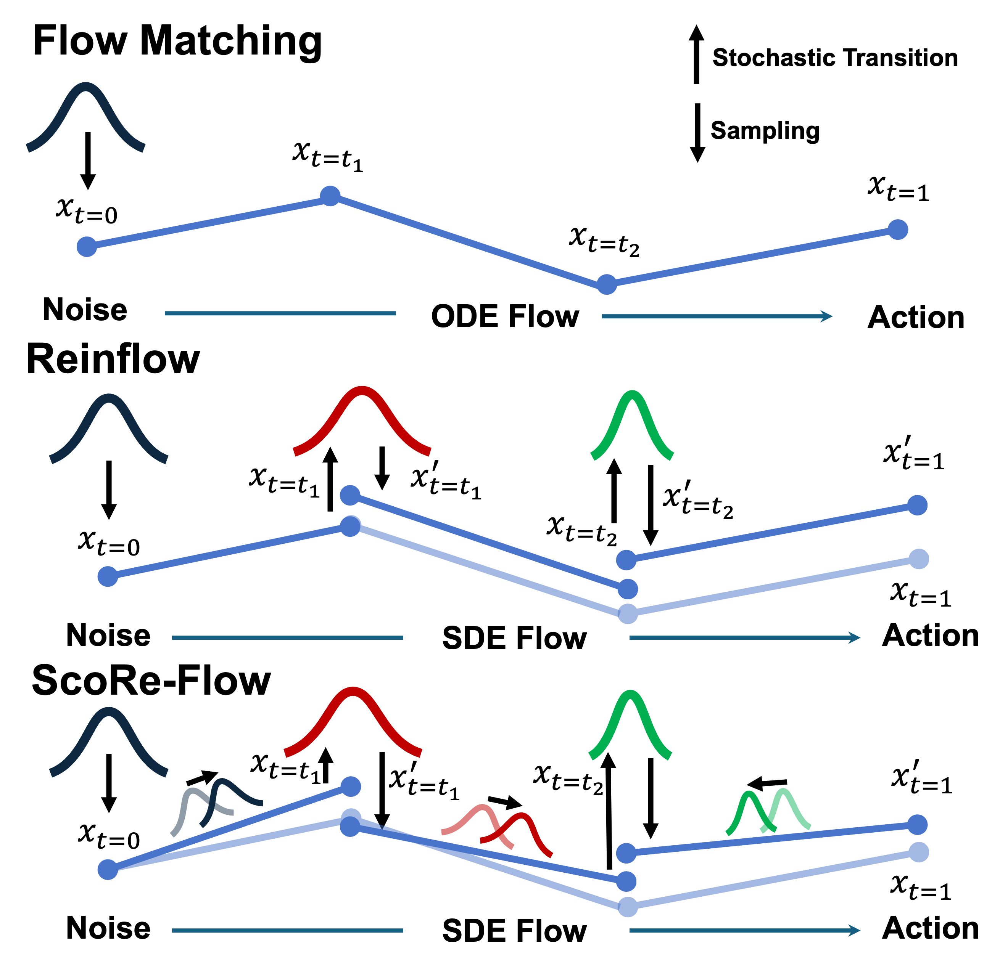

# ScoRe-Flow

> **ScoRe-Flow: Complete Distributional Control via Score-Based Reinforcement Learning for Flow Matching**

<p align="center">
  
</p>

---

## 📋 Table of Contents

- [Overview](#-overview)
- [Key Features](#-key-features)
- [Installation](#-installation)
- [Quick Start](#-quick-start)
- [Project Structure](#-project-structure)
- [Experiments](#-experiments)
- [Configuration](#-configuration)
- [License](#-license)

---

## 🎯 Overview

**ScoRe-Flow** is a novel framework that achieves complete distributional control for flow matching policies through score-based reinforcement learning. Our approach enables precise policy optimization by leveraging score functions to guide the learning process.

### Core Contributions

- **Score-Based RL Framework**: A principled approach to integrate score functions with reinforcement learning for flow matching
- **Distributional Control**: Complete control over the action distribution at any denoising step
- **Efficient Training**: End-to-end trainable noise injection network for tractable policy probabilities

---

## ✨ Key Features

| Feature | Description |
|---------|-------------|
| **Flow Matching** | Support for 1-Rectified Flow and Shortcut Models |
| **Score-Based RL** | Integration of score functions for precise policy control |
| **Multi-Environment** | Tested on Gym, Kitchen, and Robomimic benchmarks |
| **Flexible Architecture** | MLP and Transformer-based policy networks |
| **Visual Observations** | Support for image-based control tasks |

---

## 🛠 Installation

### Prerequisites

- Python >= 3.8
- PyTorch >= 2.4.0
- CUDA (recommended for GPU acceleration)

### Setup

```bash
# Clone the repository
git clone https://github.com/ScoRe-Flow/ScoRe-Flow.git
cd ScoRe-Flow

# Install as editable package (REQUIRED - enables running scripts from any directory)
pip install -e .

# For specific environments, add optional dependencies:
pip install -e ".[gym]"        # OpenAI Gym (Hopper, Walker2d, Ant)
pip install -e ".[kitchen]"    # Franka Kitchen
pip install -e ".[robomimic]"  # Robomimic (Square, Can, Lift)
```

> **Note**: The `pip install -e .` step is essential. It registers `util`, `agent`, `model` etc. as importable modules.

For detailed installation instructions, see [installation/reinflow-setup.md](./installation/reinflow-setup.md).

---

## 🚀 Quick Start

### Training Example

```bash
# Set environment variables
export MUJOCO_GL="osmesa"
export PYOPENGL_PLATFORM="osmesa"

# Run training
python script/run.py \
    --config-dir=cfg/robomimic/finetune/square \
    --config-name=ft_ppo_reflow_mlp_img_score \
    device=cuda:0 \
    seed=42
```

### Evaluation

```bash
# Evaluate trained model
bash script/eval/robomimic.sh
```

---

## 📁 Project Structure

```
ScoRe-Flow/
├── agent/                  # Training and evaluation agents
│   ├── pretrain/          # Pre-training agents
│   ├── finetune/          # Fine-tuning agents (DPPO, ReinFlow, etc.)
│   └── eval/              # Evaluation utilities
├── model/                  # Neural network architectures
│   ├── flow/              # Flow matching models
│   ├── diffusion/         # Diffusion models
│   ├── common/            # Shared components (MLP, Transformer, Critic)
│   └── rl/                # RL algorithms
├── cfg/                    # Hydra configuration files
│   ├── gym/               # Gym environment configs
│   ├── robomimic/         # Robomimic configs
│   └── furniture/         # Furniture assembly configs
├── env/                    # Environment wrappers
├── script/                 # Training and utility scripts
│   ├── train/             # Training scripts by environment
│   │   ├── gym/           # OpenAI Gym training
│   │   ├── kitchen/       # Franka Kitchen training
│   │   └── robomimic/     # Robomimic training
│   └── eval/              # Evaluation scripts
├── data_process/           # Data preprocessing utilities
└── docs/                   # Documentation
```

---

## 🧪 Experiments

### Supported Environments

| Environment | Type | Observation |
|------------|------|-------------|
| OpenAI Gym (Hopper, Walker2d, Ant) | Locomotion | State |
| Franka Kitchen | Manipulation | State |
| Robomimic (Square, Can, Lift) | Manipulation | Image |

### Reproducing Results

```bash
# Pre-training
bash script/train/robomimic/pretrain.sh

# Fine-tuning with Score-Based RL
bash script/train/robomimic/finetune_score.sh
```

For complete experiment reproduction, see [docs/ReproduceExps.md](docs/ReproduceExps.md).

---

## ⚙ Configuration

We use [Hydra](https://hydra.cc/) for configuration management.

### Key Parameters

| Parameter | Description | Default |
|-----------|-------------|---------|
| `train.n_train_itr` | Training iterations | 301 |
| `train.n_steps` | Steps per iteration | 400 |
| `train.batch_size` | Batch size | 500 |
| `train.actor_lr` | Actor learning rate | 1e-5 |
| `train.critic_lr` | Critic learning rate | 1e-3 |
| `train.gamma` | Discount factor | 0.999 |
| `env.n_envs` | Parallel environments | 50 |

### Example Configuration Override

```bash
python script/run.py \
    --config-dir=cfg/robomimic/finetune/square \
    --config-name=ft_ppo_reflow_mlp_img_score \
    train.n_train_itr=500 \
    train.batch_size=256
```

---

## 📚 Documentation

- [Installation Guide](installation/reinflow-setup.md)
- [Experiment Reproduction](docs/ReproduceExps.md)
- [Implementation Details](docs/Implement.md)
- [Custom Environments](docs/Custom.md)
- [Known Issues](docs/KnownIssues.md)

---

## 📄 License

This project is licensed under the MIT License. See [LICENSE](LICENSE) for details.
